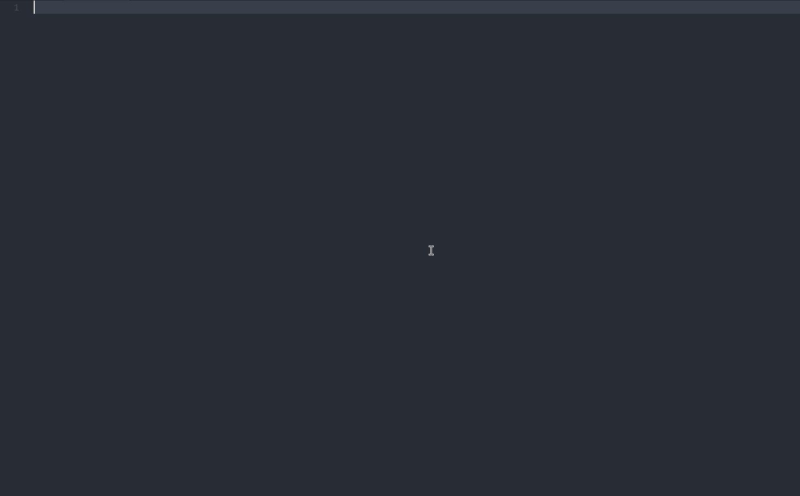

# Preact/preact-router Snippets

    

 

 

Useful Preact Ecosystem snippets for [Visual Studio Code](https://code.visualstudio.com/), including:

* Quick import
* Preact
* Preact-router

## Screenshot

## Usage

Please check [to see all avaliable snippets](https://github.com/SaraVieira/vscode-preact-preact-router-snippets/blob/master/snippets/snippets.json)

## Acknowledgments

Forked from:
* [Reactjs code snippets](https://github.com/discountry/vscode-react-redux-react-router-snippets)

## License

[MIT](LICENSE)

